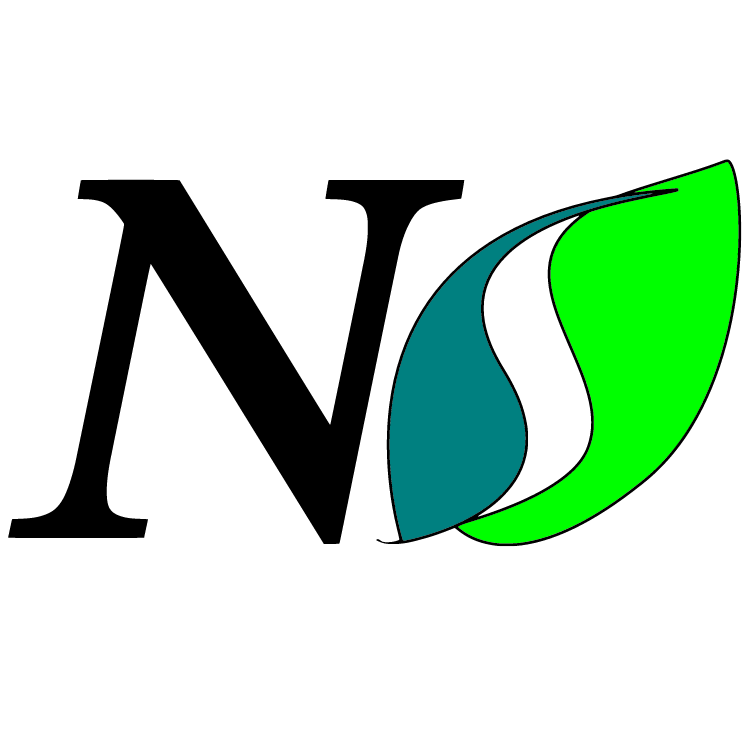
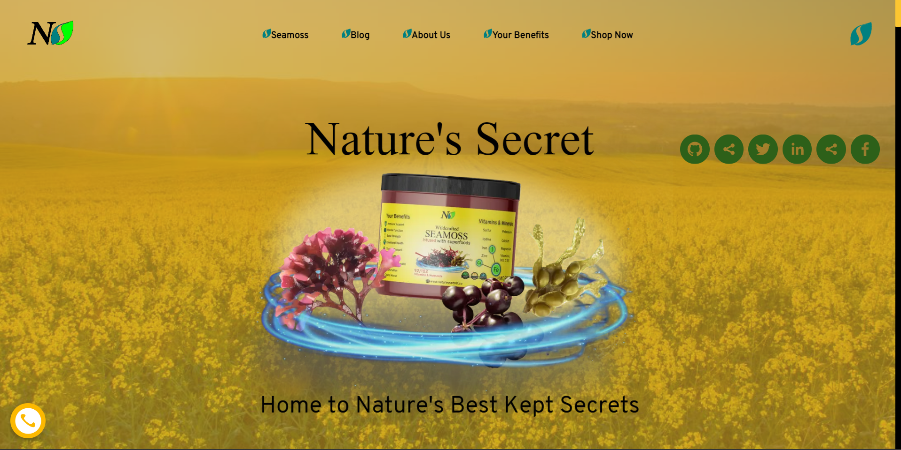

# Nature's Secret

### 🌿Home to Nature's Best Kept Secrets.

 [](https://choosealicense.com/licenses/mit/) |  |  ww



---

## 📷Screenshots



---

## ✨Features

* Gumroad API Integration
* Notion API Integration
* Progressive Web App Mode
* Social Media Share
* Blog
* Search Engine Optimization
* 

---


## 🔨Installation


```bash
 git clone https://github.com/naturessecretco/naturessecretco.git
  cd app
  npm run bootstrap
```

---
    
## 🆘Support

For support, email info@naturessecret.co

---

## ⌚Changelog


**Version 1.0.1**
* Optimized Page Navigation
* Ingridents Page Added


**Version 1.0.0**
* Facade Service (v0.0.1) Integrated. Allowing future-proof extensions.
* API Maintanence 


**Version 0.0.9**
* Views 'Simply-Typed', parametermized as needed for cms data transformations. 
* Animations optimized. 
* App Layout polyfilled. 

---

## ➰Feedback

If you have any feedback, please reach out to us at help@desirable.solutions

---

## ⚙️Tech Stack

* React
* Blackprint UI
* Recoil
* TailwindCSS
* NextJS
* Notion API
* Facade 
  
---

## 🛣️Roadmap


**Phase E**
1. Community Marketing 

**Phase D**
1. Community Marketing 


**Phase C**
1. Community Marketing 


**Phase B**
1. Community Marketing 


📍**Phase A**  
* 🎉MVP Launch!

---


## 🙏🏿Acknowledgements

 > To God Be All the Glory. 

---

## ✒️Authors

- [@desirtech](https://www.github.com/desir-tech)
- [@desirdesigns](https://www.github.com/desir-designs)
- [@desirablesolutions](https://www.github.com/desirablesolutions)


---

## 📜License

> This project is under the MIT License☂️. 

**All data & metadata property of Nature's Secret, LLC**<br/>
**©️ 2022 Nature's Secret. All Rights Reserved.**

